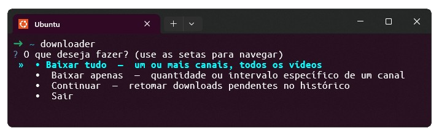

# Como baixar o Telegram Downloader?
Acesse a [página de releases](https://github.com/dan-alvares/telegram_downloader/releases) e faça download da última versão disponível.
Para builds para Linux, basta rodar o **build.sh** ou **make build**.

# Instruções de uso

Antes de utilizar o CLI, é preciso obter chaves de API do Telegram

Para isso, siga os passos:

1) Acesse e realize login no Telegram em: https://my.telegram.org.
2) Depois acesse https://my.telegram.org/apps e preencha os dados do nome da aplicação e nome curto.
3) Salve as informações obtidas **App api_id** e **App api_hash**.
4) Abra o arquivo .env na pasta raiz e preencha da seguinte forma:  

```txt
TG_API_ID=App api_id
TG_API_HASH=App api_hash
DOWNLOAD_SIM=3
```

5) Insira os valores sem aspas, sem espaços e salve o arquivo .env.
6) Se desejar baixar mais vídeos de maneira simultânea, altere o valor da **variável DOWNLOAD_SIM** no seu arquivo .env
7) Depois basta seguir com a abertura do CLI, obter o link do grupo que deseja baixar seu conteúdo e seguir as instruções em tela.
8) Ao baixar o conteúdo, será criado um diretório com subpastas, exemplo: downloads/<nome do conteúdo baixado>.

O CLI agora pode ser utilizado simplesmente abrindo o seu executável. Após abrir será apresentado um menu para escolher as principais funções, como apresentado na seção comandos deste README.

---
**Nota**: para obter o link correto para baixar vídeos de um canal, basta clicar com o botão direito e depois clicar em `Copy Post Link` sobre vídeos dentro de um grupo/canal após clicar em JOIN e fazer parte dele.

Se você não fizer parte desse grupo/canal, não será possível baixar o seu conteúdo.

---
## Comandos

``downloader.exe baixar tudo``

Com este comando você será perguntado em seguida o link para o canal/grupo e o programa baixará todos os vídeos disponíveis, os salvando na pasta downloads/**nome-do-canal**.

Ainda é possível baixar o conteúdo de vários canais, em fila, fornecendo diversos links separados por vírgula. Por exemplo, ao ser perguntado pelo CLI, basta informar: `https://t.me/c/link_A, https://t.me/c/link_B`. O programa irá organizar a fila, baixando primeiro o link A e depois o link B.

---

``downloader.exe baixar apenas``

Já este comando baixará apenas os últimos **n** vídeos informados via input prompt do CLI, os salvando na pasta downloads/**nome-do-canal**.

Com ele é possível solicitar o download de apenas um vídeo, uma série de vídeos num intervalo ou vários vídeos específicos numa ordem exata.

**Para baixar um vídeo específico**, basta apenas informar o número que representa a ordem do vídeo dentro do canal. Se é a décima mensagem publicada, basta informar o número 10 no prompt.

> 10

**Para baixar uma série (sequência) de vídeos**, basta informar um intervalor separado por hífen, informando o intervalo no prompt, na forma "ínicio-fim", do menor para o maior.

> 4-33

**Para baixar vídeos específicos**, basta informar o número correspondente a cada vídeo, separados por vírgula, não importanto ordem, se é maior ou menor.

> 3, 7, 22, 14, 65

---

``downloader.exe baixar continuar``

Este comando irá retomar o download de conteúdo inacabado, do ponto onde parou.

---

O CLI agora conta com um simples histórico de vídeos. Assim, se por alguma razão o download for interrompido, o programa buscará o ponto que deverá retomar o download, baixando todos os arquivos incompletos.

**Este CLI não é afiliado de qualquer maneira com o Telegram e não me responsabilizo por seu uso.**